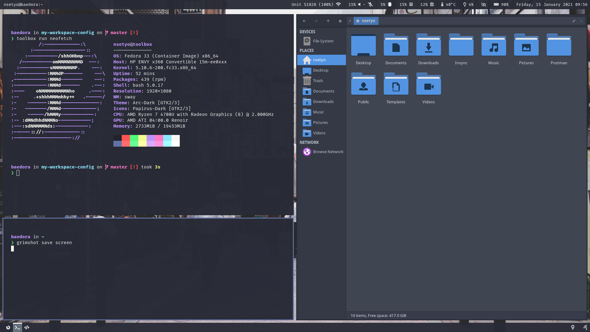

### My Daily Workspace Configuration

- **OS**: [Fedora](https://getfedora.org/)
- **Terminal**: [Kitty](https://sw.kovidgoyal.net/kitty/)
- **Shell**: Zsh with [OhMyZsh](https://ohmyz.sh/) 
- **WM**: [Sway](https://github.com/swaywm/sway)
- **Panel**: [Waybar](https://github.com/Alexays/Waybar)
- **Launcher**: [Wofi](https://hg.sr.ht/~scoopta/wofi)
- **Screenlock**: [Swaylock](https://github.com/swaywm/swaylock)
- **Gtk Theme**: [Arc-Dark [Gtk2/3]](https://github.com/horst3180/Arc-theme)
- **Icons**: [Papirus](https://github.com/PapirusDevelopmentTeam/papirus-icon-theme)
- **Fonts**: [Fira Code](https://github.com/tonsky/FiraCode)

#### Requirements
1. [Swayidle](https://github.com/swaywm/swayidle)
2. [Grim](https://wayland.emersion.fr/grim/)
3. [Mako](https://github.com/emersion/mako)
4. [Font Awesome 5](https://fontawesome.com/)
5. [Brightnessctl](https://github.com/Hummer12007/brightnessctl)
6. [Playerctl](https://github.com/altdesktop/playerctl)
7. [NetworkManager-tui](https://pkgs.org/download/networkmanager-tui)
8. [Gammastep](https://gitlab.com/chinstrap/gammastep)